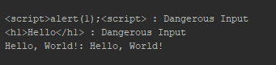

# AntiXSS
Anti XSS Injection

`java` + `C#`

    System.out.println("<script>alert(1);<script> : " + SecurityUtility.antiXSS("<script>alert(1);<script>"));
    System.out.println("<h1>Hello</h1> : " + SecurityUtility.antiXSS("<h1>Hello</h1>"));
    System.out.println("Hello, World!: " + SecurityUtility.antiXSS("Hello, World!"));
  

